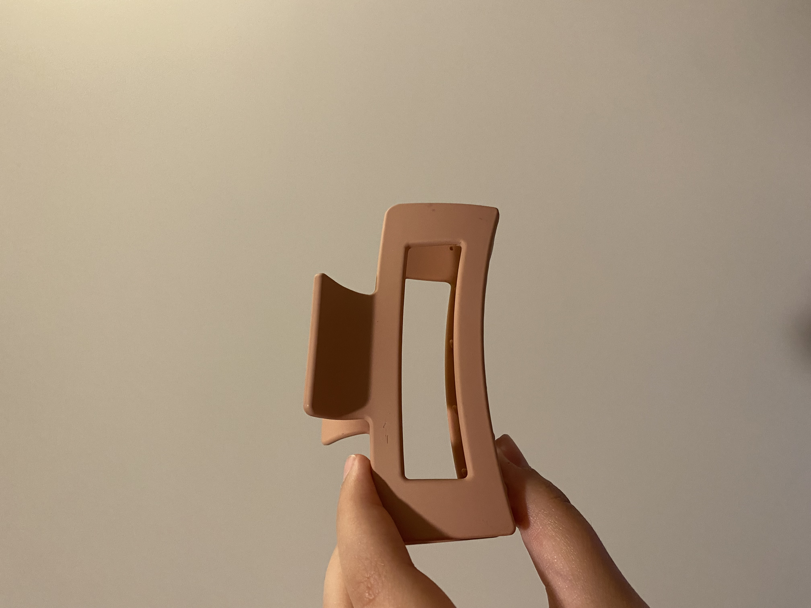
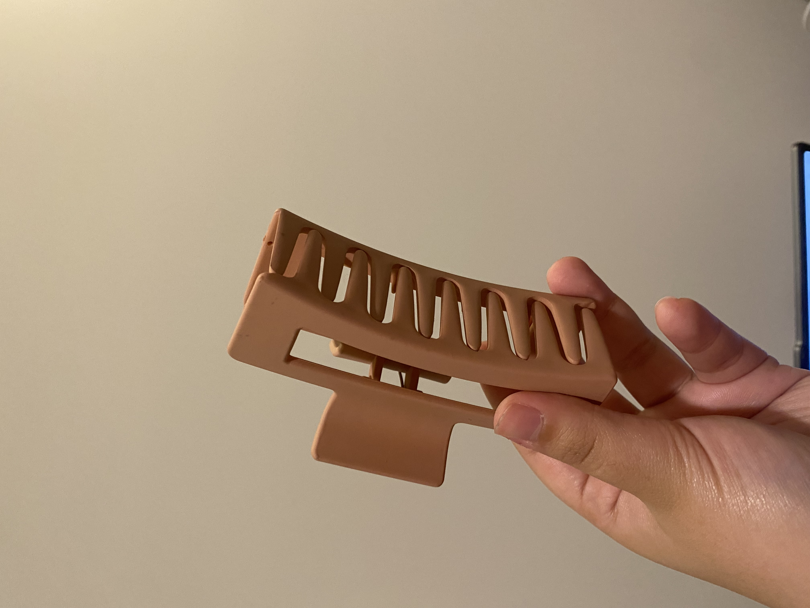
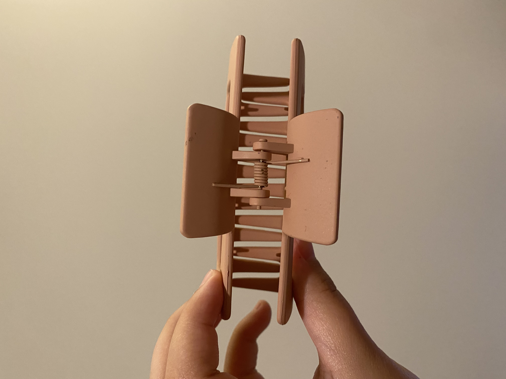
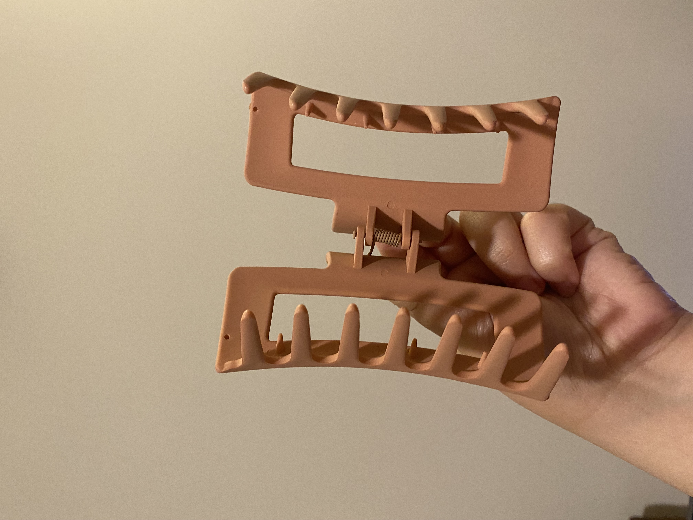

# A1 – Create a Portfolio

## Objective
The objective of this assignment is to build a professional engineering portfolio that documents my development as an engineer through analysis, engineering decisions, and technical communication. The portfolio will be used throughout the semester to document my work and demonstrate my ability to analyze problems, justify engineering decisions, and communicate my reasoning clearly.

## Analyze
**Task A: Portfolio Analysis**

For this task, I analyzed two engineering portfolios using four functional requirements: navigability, reproducibility, evidence of reasoning, and professional tone.

**Portfolio 1 — Gavin Poloche**

a. Navigability:
A reader can locate a specific piece of work in under 60 seconds. The portfolio separates the author's personal information from engineering content and identifies major technical sections, including the discussion of force and the analysis of the Uni-ball Kuru Toga mechanical pencil. The headings make it possible for a reader to quickly identify where the relevant engineering work is located.

b. Reproducibility:
The portfolio provides some information that would allow a colleague to understand the general design being analyzed, including the primary function of the mechanical pencil, its patent number, the inventors, an alternative design, and information about its materials. It also includes two images of the pencil and its eraser cap, which help visually clarify the components being discussed. However, the documentation does not contain enough technical information for a colleague to fully reproduce the analysis without asking questions. In particular, there are no calculations or quantitative measurements provided. The analysis would be more reproducible with measurements, diagrams, calculations, and additional details about the rotating lead mechanism.

c. Evidence of Reasoning:
The portfolio provides evidence of engineering reasoning in the discussion of the author's ENGR 1201 project. The author explains how the use of basic materials affected the design process and describes how prototyping and trial-and-error contributed to the final product. The Kuru Toga analysis also connects specific geometric features, such as the pencil tip and rotating lead mechanism, to their intended functions. However, the reasoning is primarily qualitative, with limited quantitative analysis or comparison of engineering criteria.

d. Professional Tone:
The portfolio communicates genuine engineering interests and includes relevant technical concepts, but the writing contains grammatical errors, informal phrasing, inconsistent capitalization, and some statements that are more personal than professional. For example, some sections focus heavily on personal motivation rather than presenting engineering information in a format intended for a professional reader. A stronger professional presentation would use more consistent technical language, clearer organization, and careful proofreading.

**Portfolio 2 — Sammari Tate**

a. Navigability:
The portfolio uses clearly labeled sections such as About Me, How Force Affects Mechanical Design, and Swingline Stapler. These headings help separate personal information from technical analysis and make the main topics identifiable to a reader.

b. Reproducibility:
The portfolio provides more detailed qualitative documentation of the stapler than a reader would get from only a final answer. It identifies several components, explains their functions, provides patent references, and discusses alternative stapler designs and manufacturing methods. In addition, the inclusion of multiple images from different angles—including internal views showing the spring and internal mechanisms—significantly improves the clarity of the design description and helps the reader understand how the stapler operates.

c. Evidence of Reasoning:
The portfolio provides strong qualitative evidence of engineering reasoning. The author explains how specific components transmit force and how the geometry and orientation of the handle, driver blade, and anvil contribute to the stapler's operation. The discussion of the ENGR 1201 mousetrap-powered car also demonstrates reasoning by identifying a design-process failure and explaining how the team adapted when the axle broke. The portfolio shows that the author is considering not only what the product does, but also why particular design features may have been selected.

d. Professional Tone:
The portfolio generally communicates the author's engineering interests and technical observations, but there are areas where the writing could be made more professional. Some sentences are lengthy, informal, or grammatically inconsistent, and some statements about manufacturing materials and processes are presented as assumptions without supporting evidence. A more professional engineering document would distinguish clearly between observed facts, researched information, and engineering inference.

**Task B: Product Analysis**
For this task, I selected a Hair Claw Clip as the mechanical product to analyze.

_**a. Product Function**_

The primary function of the claw clip is to apply and maintain a clamping force to secure a bundle of hair between its two opposing plastic halves. When the user applies an external force to open the clip, the two halves rotate about their central connection and compress the metal spring. When the external force is released, the spring produces a restoring torque that rotates the two halves back toward the closed position, causing the teeth of the clip to apply opposing forces to the hair and maintain its position. The clip therefore converts the user's applied force and the spring's stored elastic energy into a sustained mechanical clamping force

_**b. Governing Model**_

The primary mechanical behavior of the claw clip can be modeled using a torsional spring relationship combined with rotational equilibrium. The metal spring stores elastic energy when the two plastic halves of the clip are rotated apart. When the user releases the clip, the spring produces a restoring torque that causes the two halves to rotate toward one another and generate the clamping force that secures the hair.

The torsional spring model is:

**𝜏=𝑘𝜃**   or Tau=k*Theta

where:

𝜏 = restoring torque produced by the spring,
k = torsional spring constant,
𝜃 = angular deflection of the spring from its unloaded position

The restoring torque is transferred through the clip geometry and produces a clamping force at the teeth of the clip. Using moment equilibrium, the approximate clamping force can be represented as:

𝐹_jaw= 𝜏/𝐿= (𝑘𝜃)/𝐿

(F_jaw) = approximate clamping force applied by the clip, 
(L) = perpendicular distance from the spring's rotational axis to the effective point where the clamping force acts

This model shows that increasing the spring stiffness or increasing the spring's angular deflection increases the available clamping torque, while the geometry and moment arm determine how that torque is converted into the force applied to the hair.

-Assumption: The clip is assumed to behave as a rigid-body mechanism with small elastic deformation of the plastic halves, so the spring torque is the dominant source of the clamping force.

_**c. Component Geometry**_

Component 1: Left jaw 

-Curved outer shell: Provides finger contact area; its curvature sets the moment arm for applied finger force

-Inner teeth (comb‑like prongs): Increase local contact pressure and friction with hair by concentrating force at discrete points.

-Hinge ear with hole: Defines the rotation axis and transmits torque from the spring into the jaw.

The left jaw is a rigid plastic body with an ear that forms a pivot about the hinge axis. Its curved finger pad increases the moment arm of the applied finger force, reducing the required force to open the clip. The comb‑like teeth concentrate the clamping force into discrete contact points, increasing friction and preventing hair slip under gravity

Component 2: Right jaw

The right jaw mirrors the left jaw, forming an opposing set of teeth that interlock with the left jaw’s teeth. This symmetric geometry ensures that the normal forces on the hair bundle are distributed from both sides, increasing friction and stabilizing the hair. The matching hinge ear allows both jaws to rotate about the same axis, forming a single degree‑of‑freedom clamping mechanism

Component 3: Torsion spring
Geometry features:

-Coiled body around hinge pin: Stores elastic energy in twist.

-Two projecting legs: Press against each jaw, transmitting torque.

-Wire diameter and coil count: Set stiffness 𝑘

The torsion spring is a coiled metal wire wrapped around the hinge pin, with two legs that bear against the inner surfaces of the jaws. When the jaws are opened, the legs rotate relative to the coil, twisting the spring and storing elastic energy. The spring’s wire diameter, coil count, and material modulus determine the torsional stiffness 𝑘, which directly controls the clamping force applied to the hair when the jaws close

_**d. Patent Research**_

**U.S. Patent No. US8087416B2 — “Hair clip with concealed hinge spring”**

**Inventors**: Michael Defenbaugh and Justin Recchion

**Assignee**: Goody Products, Inc

_**i. Alternative Solutions**_

Two alternative devices that perform the same primary function as the claw clip are a _hair tie_ (rubber band/ scrunchies) and a _bobby pin_, both have the same primary function- clamp hair and resist sliding

Elastic hair tie (rubber band / scrunchie): Uses circumferential tension in an elastic band to compress hair into a bundle.

Bobby pin: Uses elastic bending of a U‑shaped metal strip to apply normal force to hair between its legs.

The claw clip differs from both alternatives because it converts the deformation of a torsion spring into rotational motion of two hinged jaws. The teeth on the jaws then distribute the clamping force across multiple contact points. This allows the clip to secure a larger bundle of hair while remaining reusable and easy to open and close.

_**ii. Design Decision**_

One observable design decision is the use of multiple curved teeth along both jaws instead of a single continuous clamping surface. The teeth extend inward from both sides of the clip and create multiple discrete contact points with the hair. This geometry allows the clamping force generated by the torsion spring to be distributed across several locations rather than concentrated at one contact surface.

I believe this design was selected to increase the clip's ability to resist hair slipping while keeping the clip lightweight and allowing it to accommodate different amounts of hair. The spaces between the teeth also allow the jaws to interlock without requiring the entire surfaces of the two halves to contact one another. As a result, the clip can close around a range of hair thicknesses while maintaining contact through the individual teeth. This design decision therefore connects the geometry of the jaws directly to the product's primary mechanical function of maintaining a clamping force on the hair.

## Decide
**1. Homepage Identity**

The homepage is designed to give a first-time reader an immediate understanding of what this portfolio contains, how the information is organized, and what standard the documentation follows. Because the intended reader may be an engineering instructor, future employer, or professional reviewing my work, the homepage identifies me as a Mechanical Engineering student with a concentration in Biomedical Engineering and presents the site as a record of engineering analysis, design decisions, and technical communication. The navigation separates general information about me from the portfolio overview and individual assignments so that a reader can quickly locate the information they need. The homepage also establishes the Analyze, Decide, and Communicate framework as the standard for the portfolio, signaling that each assignment will document not only the final result but also the reasoning and decisions that produced it.

**2. One Intentional Customization**

I changed the portfolio's primary color from green to blue. I made this change to give the portfolio a distinct visual identity while maintaining a consistent and readable interface. The color change also helps create visual separation between the site's navigation elements and its main content, making the website easier for an external reader to navigate. I selected the change based on the functional requirement of improving the organization and usability of the portfolio rather than simply changing the appearance based on personal preference.

**3. Documentation Standard**

For every assignment, I will identify the governing engineering model, state the assumptions and constraints used, explain the reasoning behind my decisions, support my conclusions with appropriate evidence, and present my work clearly enough that another engineer could understand and reproduce my analysis without needing additional explanation

## Communicate
**About Me**

My name is Rama Hamid, and I am a Mechanical Engineering student at the University of North Carolina at Charlotte with a concentration in Biomedical Engineering. I chose mechanical engineering because I have always been fascinated by how physical systems work, especially in areas like physics, design, and aerospace concepts. I enjoy understanding how things move, how forces interact, and how engineering principles can be used to create functional and efficient systems. At the same time, I have always had a strong interest in medicine and originally wanted to become a doctor, which is where my interest in biomedical engineering comes from.

Over time, I realized that I did not have to choose between these two passions. Biomedical engineering felt like the perfect intersection of both of my interests: the technical, problem-solving side of mechanical engineering and the human, healthcare-focused side of medicine. This combination allows me to apply engineering principles to improve medical technology, patient care, and overall health outcomes. I am especially interested in biomechanics, biomaterials, medical devices, and other areas where engineering directly interacts with the human body.

As I continue developing as an engineer, I want to become someone who can approach unfamiliar problems systematically, identify the relevant engineering principles, make reasonable assumptions, and justify the decisions made during the design process. My coursework in mechanics, thermodynamics, solid mechanics, computational methods, and electrical and mechatronics systems has helped me build that foundation. Research experiences related to biomedical engineering and biomaterials have also helped me see how engineering concepts can be applied to real healthcare challenges.

I am particularly interested in a future career involving biomedical engineering and medical technology, where I can continue blending my interests in engineering, physics, and medicine. I want to gain experience working with both engineers and healthcare professionals to better understand how engineering decisions impact real clinical needs. I also value continuous improvement and learning from mistakes, because engineering problems rarely have perfect conditions. I believe a strong engineer must be able to adapt, evaluate situations critically, and make the best defensible decision with the information available.

**Defending an Engineering Decision**

To defend an engineering decision means being able to explain not only what choice was made, but also why that choice was appropriate based on the available information, assumptions, constraints, and governing engineering principles. At this point in my education, I can defend simpler engineering decisions by explaining my calculations, assumptions, and reasoning, but I am still developing my ability to evaluate competing alternatives and justify decisions using engineering criteria. I expect this ability to improve throughout the semester as I work through increasingly complex engineering problems and design decisions

**Time Spent**
I spent approximately 6 hours and 2 minutes working on this assignment

